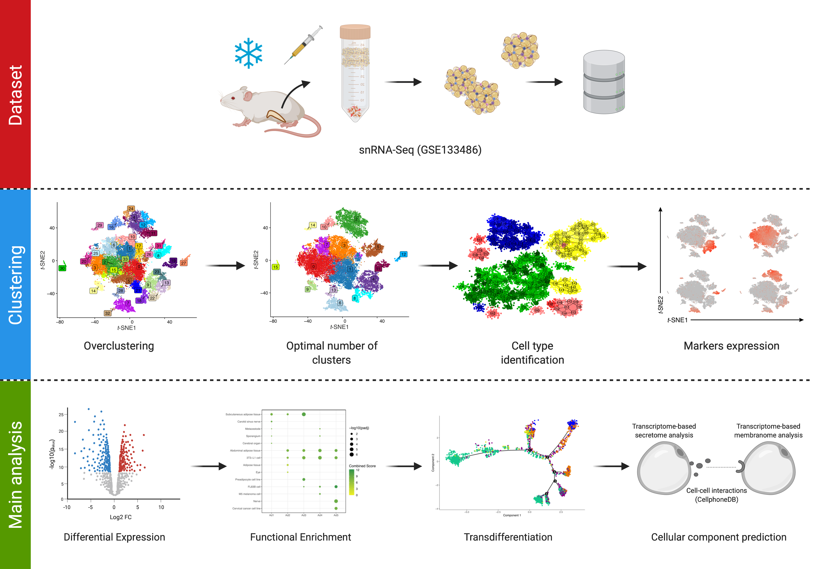

# AdipoSNAP: Adipose Single-Nuclei Analysis Pipeline 

## Table of Contents
- [What is this?](#what-is-this)
- [Workflow](#workflow)
- [How can I use this data, and where can I find it?](#how-can-i-use-this-data-and-where-can-i-find-it)
	- [Downloading Data files](#downloading-data-files)
- [Analysis and visualization programs](#analysis-and-visualization-programs)
	- [Cellranger software from 10X Genomics:](#cellranger-software-from-10x-genomics)
	- [R and R's integrated developmental environment RStudio:](#r-and-rs-integrated-developmental-environment-rstudio)
	- [scRNAseq analysis pipeline SEURAT developed by the Satija lab:](#scrnaseq-analysis-pipeline-seurat-developed-by-the-satija-lab)
	- [Pseudotemporal gene expression analysis using Monocle developed by the Trapnell Lab:](#pseudotemporal-gene-expression-analysis-using-monocle-developed-by-the-trapnell-lab)
	- [3D tSNE analysis and Gene expression plotting](#3d-tsne-analysis-and-gene-expression-plotting)
- [Setting up the right environment](#setting-up-the-right-environment)
- [Computing environment](#computing-environment)
	- [Hardware and OS environment for running Seurat and Monocle](#hardware-and-os-environment-for-running-seurat-and-monocle)
- [Citation](#citation)
- [Contributors](#contributors)
- [Lead Contacts](#lead-contacts)
- [Acknowledgements](#acknowledgements)

## What is this?
This repository contains coding scripts utilized for the analysis performed in the "Single-nuclei reconstruction of the adipose tissue using AdipoSNAP (Adipose Single-Nuclei Analysis Pipeline) reveals the mature adipocyte landscape underlying thermogenic response" publication [(XXX)](XXX). The purpose of providing the code here is to allow for transparency and robust data-analysis reproducibility. Most of the steps used for data analysis and visualization have been optimised for an average computing environment (for the year 2019). Some analyses however, require a high-performace computing environment (see computing environment). The methodology has already been described extensively in the manuscript. However, this analysis relies heavily on powerful scRNAseq analysis algorithms developed by the [Satija lab](https://satijalab.org/), namely [Seurat](https://satijalab.org/seurat/) [(Butler et al., 2018: Nature Biotechnology;](https://www.nature.com/articles/nbt.4096) [Stuart et al., 2018: Cell)](https://www.sciencedirect.com/science/article/pii/S0092867419305598?via%3Dihub) (for a complete list of dependencies and code utilized see analysis & visualization programs).

## Workflow

## How can I use this data, and where can I find it?
### Downloading Data files
Data files utilized in this analysis have been deposited in the [Gene Expression Omnibus (GEO)](https://www.ncbi.nlm.nih.gov/geo/), gene expression data repository at the NIH. Data are part of the GSE131886 high-thoroughput sequencing repository and can be found [here](https://www.ncbi.nlm.nih.gov/geo/query/acc.cgi?acc=GSE131886). Data files have been renamed allowing for sample-origin information to be incorporated. Supplementary files contain Cellranger output files, which have been renamed to ensure clarity. Change file names (of filtered information) to 'matrix.mtx.gz', 'barcodes.tsv.gz' and 'features.tsv.gz' after seperating files into donor specific folders. This is necessary, to allow Seurat to read these files. Seruat cannot read files named in their current form. Please note, (unless you are a reviewer or journal editor) since this manuscript is currently under review, GSE raw data files will not be present for public download. If you would like to download the data, please email the project leader for requests.

## Analysis and visualization programs
### Cellranger software from 10X Genomics:
1. [Cellranger](https://support.10xgenomics.com/single-cell-gene-expression/software/pipelines/latest/installation)
### R and R's integrated developmental environment RStudio:
1. [R v3.5.3 (x64 bit)](https://cran.r-project.org/bin/windows/base/old/)
2. [RStudio v1.2.1335 (x64 bit)](https://www.rstudio.com/products/rstudio/download/)
3. [RTools v3.3.X](https://cran.r-project.org/bin/windows/Rtools/index.html)
4. [Tutorial for R](https://cran.r-project.org/doc/manuals/r-release/R-intro.html)
5. [Tutorial for RStudio](https://resources.rstudio.com/)
### scRNAseq analysis pipeline SEURAT developed by the Satija lab:
1. [Source code for Seurat v3.0.0](https://cran.r-project.org/web/packages/Seurat/index.html)
2. [Tutorials for Seurat](https://satijalab.org/seurat/)
### Pseudotemporal gene expression analysis using Monocle developed by the Trapnell Lab:
1. [Source code for Monocle v2.8.0](https://bioconductor.org/packages/release/bioc/html/monocle.html)
2. [Tutorial for Monocle](http://cole-trapnell-lab.github.io/monocle-release/docs/#constructing-single-cell-trajectories)
### 3D tSNE analysis and Gene expression plotting
1. [Source code for plotly](https://cran.r-project.org/web/packages/plotly/index.html)
2. [Tutorial for plotly](https://plot.ly/r/)

## Setting up the right environment
1. Install R
2. Install Rstudio
3. You are ready to rumble in the jungle. 
4. Once you have installed R and RStudio, copy script from the [first file](https://github.com/JDBLab/Pancreas_ductal_scRNAseq/blob/master/R_analysis_by_experiment/1_environment_setup.R) in the Pancreas_ductal_scRNAseq/R_analysis_by_experiment/ folder. After this run and install all dependencies, and then load these packages allowing for analysis. 
5. If you need help understanding how commands are run in R  use the [ctrl + enter] command or please visit [here](https://support.rstudio.com/hc/en-us/articles/200484448-Editing-and-Executing-Code).
6. If you run into problems, please open a new issue, you can do this by going to 'issues' and clicking on the 'new issue' icon. We will help you replicate our analysis! Do not fear single cell analysis!

## Computing environment
### Hardware and OS environment for running Seurat and Monocle
#### Environment 1
1. Processor: Intel Sandy Bridge E5-2670 (16cores x 16 threads)
2. RAM: 25GB
3. OS: CentOS 6.5
#### Environment 2
1. Hardware integrated into the [Pegasus Supercomputing array](http://ccs.miami.edu/ac/service/pegasus/) at the [University of Miami](https://welcome.miami.edu/)

# Citation
Qadir, M.M.F., Alvarez-Cubela, S., Klein, D., Van Dijk, J., Anquela, R.M., Lanzoni, G., Sadiq, S., Moreno-Hernandez, Y.B., Navarro-Rubio, B., Garcia, M.T., Diaz, A., Johnson, K., Sant, D., Ricordi, C., Griswold, T., Pastori, R.L., Dominguez-bendala, J. (2020) Proceedings of the National Academy of Sciences. Single cell resolution analysis of the human pancreatic ductal progenitor cell niche. Apr 2020, 201918314; DOI: 10.1073/pnas.1918314117

# Contributors
1. Mirza Muhammad Fahd Qadir - [Github](https://github.com/Dragonmasterx87) - [University of Miami](http://biomed.med.miami.edu/graduate-programs/molecular-cell-and-developmental-biology/student-profiles) - to contact please [Email](mailto:fahd.qadir@med.miami.edu)
2. The JDB Lab - [Github](https://github.com/JDBLab) - [Diabetes Research Institute, UM](https://www.diabetesresearch.org/juan-dominguez-bendala)
3. Muhammad Saad Sadiq - [Github](https://github.com/msaadsadiq) - [University of Miami](http://www.coe.miami.edu/key-contacts/name/sadiq-saad/) - to contact please [Email](mailto:mss255@miami.edu)
4. Dr. Tony Griswold PhD. - [Github](https://github.com/agriswold76) - [University of Miami](http://medgen.med.miami.edu/education/msgm/meet-the-faculty) - to contact please [Email](mailto:agriswold@med.miami.edu)
5. Dr. Dave Sant PhD. - [University of Utah](https://medicine.utah.edu/dbmi/) - to contact please [Email](mailto:davidwsant@gmail.com)

# Lead Contacts
1. Dr. Juan Dominguez-Bendala PhD. - [Diabetes Research Institute, UM](https://www.diabetesresearch.org/juan-dominguez-bendala) - to contact please [Email](mailto:jdominguez2@med.miami.edu)
2. Dr. Ricardo Pastori PhD. - [Diabetes Research Institute, UM](https://www.diabetesresearch.org/ricardo-pastori) - to contact please [Email](mailto:rpastori@med.miami.edu)

# Acknowledgements
1. Diabetes Research Institute Foundation (DRIF)
2. The Inserra family
3. The Fred and Mabel R. Parks Foundation
4. The Tonkinson Foundation
5. ADA Grant #1-19-ICTS-078
6. NIH Grant #1R43DK105655-01
7. NIH Grant #2R44DK105655-02
8. NIH/NIDDK HIRN Grant #U01DK120393 (These studies are part of this grant)
9. IIE Fulbright

## If this was useful to you please dont forget to cite, star and fork this repository.